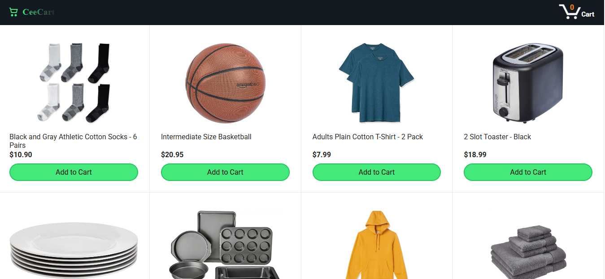
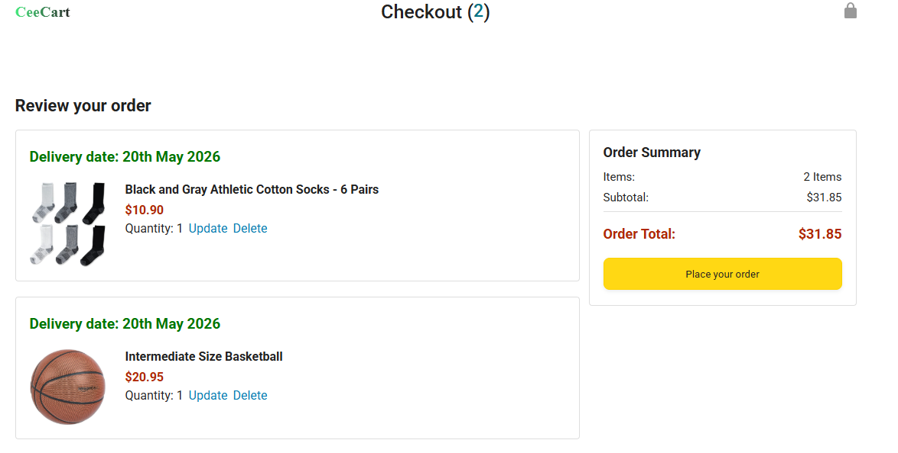

# 🛒 CeeCart – E-commerce Web App (In Progress)

CeeCart is a simple e-commerce web application built with **HTML, CSS and JavaScript**.  
This project focuses on building the core shopping experience from scratch, including product display and cart functionality.

---

## 🚀 Live Demo
🔗 https://ceecee-ferdy.github.io/ceecart/

---

## 📌 Project Status
⚠️ This project is currently **in progress**.  
The homepage and checkout system are functional, while additional features are still being developed.

---

## ✨ Features Implemented

- 🏠 Product listing (Home page)
- 🛒 Add to cart functionality
- 📦 Checkout page with order summary
- 🔄 Update item quantity
- ❌ Remove items from cart
- 💾 Persistent cart using localStorage
- 💰 Dynamic payment summary

---

## 🛠️ Built With

- HTML5
- CSS3 (Flexbox & Grid)
- JavaScript (Vanilla JS)

---

## 📚 What I Learned

- Managing application state using JavaScript
- Rendering dynamic UI with functions
- Handling user interactions (add, delete, update)
- Debugging real-world issues across logic, UI and data
- Structuring a multi-page frontend project

---

## 🚧 Upcoming Features

- 🧾 Full product details page
- 🧮 Tax & shipping calculations
- 📱 Improved mobile responsiveness
- 🎨 UI/UX enhancements
- 🔐 Checkout flow improvements
- 🌐 Fetch products from a backend API
- 🔗 URL-based search using searchParams
- 🧠 Keyword filtering system
- 🏗️ Refactor code using JavaScript classes

---

## 📸 Screenshots

### 🧾Products Page

### 🛒 Checkout Page

---

## 🤝 Acknowledgements

This project was built as part of my frontend learning journey, focusing on understanding how real-world e-commerce systems work.

---

## 📬 Contact

If you'd like to connect or give feedback, feel free to reach out.

---
